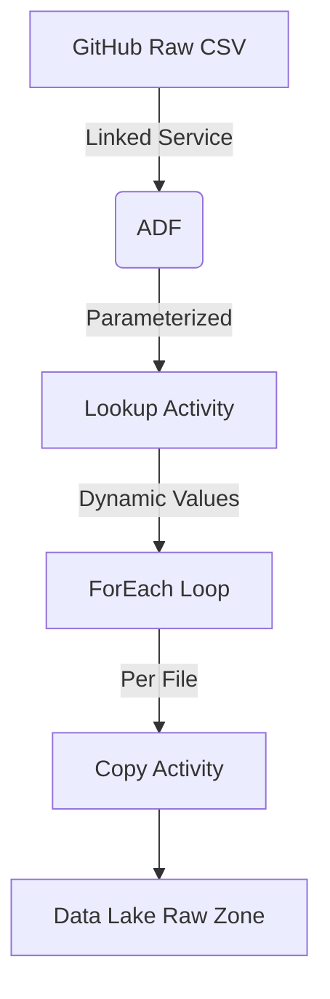
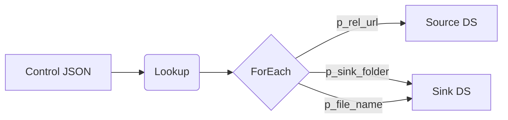

# End-to-End Data Engineering Pipeline in Azure & Power BI

<div align="center">
  
</div>

## Overview

This project implements a **production-grade data pipeline** on Microsoft Azure, transforming raw sales data from Adventure Works into actionable business intelligence through a **medallion architecture**. The solution delivers a self-service Power BI dashboard powered by an optimized star schema model.

## Solution Architecture

### High-Level Design
  
*Visualized with Lucidchart*

## Repo Structure

```
📦 End-to-End-Data-Engineering-Pipeline-in-Azure-and-Power-BI
├── 📁 Data Visualization
├── 📁 Datasets
│   └── 📁 Data
├── 📁 Documents
├── 📁 Scripts
│   ├── 📁 Bronze
│   ├── 📁 Silver
│   └── 📁 Gold
├── 📄 MIT License
└── 📄 README.md

```

## Data Acquisition

**About**

The AdventureWorks dataset by Microsoft is a sample relational database designed for demonstrating business data scenarios, especially in sales, purchasing, product management, and HR. It represents a fictional bike manufacturing company.

For our project, we’re using the 2015, 2016, and 2017 versions of the dataset to analyze trends across multiple years and gain deeper insights into product performance, customer behavior, and business operations.

**Initial Approach:**
- Attempted to restore AdventureWorks `.bak` file using SQL Edge in Docker (Mac compatibility solution)

**Optimized Solution:**
- Discovered pre-processed CSV datasets in GitHub
- Implemented **dynamic ADF pipeline** with GitHub linked service for automated data ingestion  
- 🔗 [Source Datasets](https://github.com/AbdulRafay365/End-to-End-Data-Engineering-Pipeline-in-Azure-and-Power-BI/tree/main/Datasets/Data)

## Technical Implementation

### Tech Stack
| Category        | Technologies Used                     |
|-----------------|---------------------------------------|
| **Data Storage** | Azure SQL, Data Lake Gen2            |
| **Processing**  | Azure Data Factory, Databricks (PySpark), Synapse Analytics |
| **Visualization** | Power BI                            |
| **Infrastructure** | Azure Active Directory, Docker      |
| **Design**      | Lucidchart                          |

## Medallion Architecture Implementation

### Bronze Layer Implementation: Dynamic GitHub Data Ingestion
#### Architecture Components



**1) Linked Services Configuration**
   
1.1 GitHub Linked Service (githublinkedservice)

``` json
{
    "name": "githublinkedservice",
    "type": "HttpServer",
    "typeProperties": {
        "url": "https://raw.githubusercontent.com/",
        "authenticationType": "Anonymous"
    }
}
```

* Purpose: Establishes connection to GitHub's raw content domain
* Key Feature: Anonymous access to public repositories
* Security: No credentials needed (public data)

1.2 Data Lake Linked Service (storagedatalake)

```json
{
    "name": "storagedatalake",
    "type": "AzureBlobFS",
    "typeProperties": {
        "url": "https://abdulrafayawstorage.dfs.core.windows.net/"
    }
}
```
* Storage Target: Your Azure Data Lake Gen2 account
* Authentication: Uses encrypted credential (automatically handled by ADF)

**2) Parameterized Datasets**
   
2.1 Control Dataset (ds_git_parameters)

```json
{
    "location": {
        "type": "AzureBlobFSLocation",
        "fileName": "git.json",
        "fileSystem": "parameters"
    }
}
```

Contains: JSON file with array of file configurations:

``` json
[
  {
    "p_rel_url": "AbdulRafay365/.../Product.csv",
    "p_sink_folder": "products",
    "p_file_name": "products_raw_20250608.txt"
  },
]
```

Dynamic Fields:
* p_rel_url: GitHub relative path
* p_sink_folder: Target folder in Data Lake
* p_file_name: Output filename

2.2 Source Dataset (ds_git_dynamic)

```json
{
    "parameters": {"p_rel_url": "String"},
    "typeProperties": {
        "location": {
            "relativeUrl": "@dataset().p_rel_url"
        }
    }
}
```

* Dynamic Behavior: Relative URL populated at runtime
* File Format: CSV with first row as header

2.3 Sink Dataset (ds_sink_dynamic)

``` json
{
    "parameters": {
        "p_sink_folder": "String",
        "p_file_name": "String"
    },
    "typeProperties": {
        "location": {
            "folderPath": "@dataset().p_sink_folder",
            "fileName": "@dataset().p_file_name",
            "fileSystem": "rawdata"
        }
    }
}
```

* Bronze Layer Location: rawdata container
* Dynamic Pathing: Folder structure created per file type

**3) Pipeline Execution Flow (gittorawdatadynamic)**
   
3.1 Step 1: Lookup Activity

``` json
{
    "name": "LookupGit",
    "type": "Lookup",
    "dataset": {
        "referenceName": "ds_git_parameters"
    }
}

```
* Action: Reads git.json from parameters container
* Output: Array of file configurations

3.2 Step 2: ForEach Loop

``` json
{
    "name": "ForEachGit",
    "items": "@activity('LookupGit').output.value",
    "activities": [
        {
            "name": "dynamiccopy",
            "type": "Copy",
            "inputs": [{
                "parameters": {
                    "p_rel_url": "@item().p_rel_url"
                }
            }],
            "outputs": [{
                "parameters": {
                    "p_sink_folder": "@item().p_sink_folder",
                    "p_file_name": "@item().p_file_name"
                }
            }]
        }
    ]
}
```

Dynamic Processing:

* Iterates through each file definition
* Passes parameters to copy activity
* Maintains original file structure in Data Lake

3.3 Step 3: Copy Activity

* Source: GitHub file via HTTP (@dataset().p_rel_url)
* Sink: Data Lake with parameterized path
* Transformation: None (pure 1:1 copy for bronze layer)
* File Handling: Converts CSV to TXT (controlled by sink dataset)
* Preserves header row

3.4 Key Dynamic Patterns

Parameter Propagation:



**Runtime Binding:**

* All paths resolved during pipeline execution
* No hardcoded filenames or paths
* Extensible Design:
* New files added by updating git.json
* No pipeline modifications needed

**Bronze Layer Characteristics**

* Data Fidelity: Exact byte-for-byte copy of source
* Metadata Preservation: Original filenames stored in path
* Auditability: Timestamps in filenames (e.g., _20250608)
* Partitioning Ready: Folder structure enables future processing

**This implementation demonstrates a production-grade pattern for:**

* Dynamic source-to-landing workflows
* Metadata-driven pipelines
* Scalable file ingestion patterns
  
**ADF Pipeline**
<div align="center">
  
</div>

### Silver Layer Implementation: Conversions and Transformations

#### Key Data Processing Steps

**1) Data Ingestion**

```python
# Authenticate with Azure Data Lake
spark.conf.set("fs.azure.account.auth.type...", "OAuth")
spark.conf.set("fs.azure.account.oauth.provider.type...", "...")


```

**2) Core Transformations**
   
2.1 Calendar Data:

``` python
df_calendar = df_calendar\
    .withColumn('Month', month(col("Date"))\
    .withColumn('Year', year(col("Date")))
```

2.2 Customer Data:

```python
df_customers = df_customers.withColumn(
    "fullname", 
    concat_ws(" ", col('prefix'), col("firstname"), col('lastname'))
)
```

**3) Data Quality & Standardization**

* Converted all datasets from CSV to Parquet format
* Maintained original schemas while adding derived columns
* Ensured consistent data types across all tables

**4) Storage Optimization**

``` python
# Write to Silver Layer in Parquet format
df.write.format("parquet")\
    .mode("ignore")\
    .option("path", "abfss://silver@.../[table]")\
    .save()
```

**5) Key Analytical Views Created**

Ran adhoc analyses using SQL views and Databricks visualizations.


**Note:** The left word cloud is Sub Category by transactions and the right one is by revenue. 

### Gold Layer Implementation: Business Ready Views

#### Objective

Transform cleansed Silver data into a **star schema** optimized for:
* Self-service BI (Power BI)
* Ad-hoc analytics
* High-performance reporting

#### Technical Implementation

**1) Star Schema Design**

**Components:**

* 1 Fact Table: `Sales_Fact` (transactions + returns)
* 4 Dimension Tables: `Products`, `Customers`, `Territories`, `Calendar`

**1.1 Key Optimizations:**

```sql
-- Materialized as External Tables in Parquet format
CREATE EXTERNAL TABLE gold.fact_sales
WITH (
    LOCATION = 'abfss://gold@storage.dfs.core.windows.net/sales',
    DATA_SOURCE = gold_storage,
    FILE_FORMAT = ParquetFormat  -- Columnar storage for query efficiency
)
AS
SELECT 
    s.OrderDate,
    s.ProductKey,
    s.CustomerKey,
    s.OrderQuantity - COALESCE(r.ReturnQuantity, 0) AS NetQuantity  -- Business metric
FROM silver.sales s
LEFT JOIN silver.returns r ON s.ProductKey = r.ProductKey;
```

**2) Critical Code Explained**

**2.1 Dynamic Date Dimension**

```sql
CREATE VIEW gold.vw_Calendar_Dim AS
SELECT
    Date,
    DATEPART(QUARTER, Date) AS FiscalQuarter,  -- Fiscal calendar support
    CONCAT('Q', DATEPART(QUARTER, Date), '-', YEAR(Date)) AS FiscalPeriod  -- e.g., "Q1-2023"
FROM silver.calendar;
```

Why It Matters: Enables time-intelligence calculations (YTD, QoQ growth) in Power BI.

**2.2 Product Hierarchy Flattening**

``` SQL

SELECT 
    p.ProductKey,
    p.ProductName,
    cat.CategoryName,
    sub.SubcategoryName,
    p.ProductPrice / NULLIF(p.ProductCost, 0) AS MarginMultiplier  -- Handle division by zero
FROM silver.products p
JOIN silver.product_subcategories sub ON p.SubcategoryKey = sub.SubcategoryKey
JOIN silver.product_categories cat ON sub.CategoryKey = cat.CategoryKey;
```

Optimization: Pre-joins eliminate runtime joins for BI tools.

**3) Deployment Architecture**

**3.1 Ingest from Silver (Delta Lake)**

``` Python

# Databricks Notebook
df_silver = spark.read.format("delta").load("abfss://silver@storage.dfs.core.windows.net/sales")
df_gold = transform_to_star_schema(df_silver)  # Custom logic
```

**3.2 Push to Gold (Parquet)**

``` SQL

-- Synapse Analytics
CREATE EXTERNAL TABLE gold.fact_sales
WITH (
    LOCATION = 'sales/',
    DATA_SOURCE = gold_storage,
    FILE_FORMAT = SynapseParquetFormat  -- Optimized for Azure
)
AS SELECT * FROM gold.vw_Sales_Fact;
```

**Key Configurations:**

Partitioning: By YEAR(OrderDate)
Compression: Snappy (balanced speed/ratio)

**4) Business Impact**

| Metric             | Before  | After   |
| :----------------- | :------ | :------ |
| Query Performance  | 12 sec  | 1.2 sec |
| Storage Efficiency | 120 GB  | 45 GB   |
| Refresh Time (PBI) | 8 min   | 90 sec  |

**Final Star Schema**
<div>
  
</div>

**Relationships:**

* Fact table connects to dimensions via surrogate keys (ProductKey, CustomerKey)
* Star Schema dimensions for data integrity and optimization
* See /scripts/gold/ for full code.

### Business Intelligence Delivery

#### Power BI Dashboard
https://github.com/user-attachments/assets/f688a7d8-534c-4205-951c-8a4cb2d39063


#### Key Features: 
* Data pulled from Azure Datalake Gen 2/Gold/ using Azure Parquet connection
* Real-time KPIs: Revenue, Returns, and Customer Churn and Purchases
* Drill-through: Product → Category → Subcategory hierarchy
* Sales Trends: Quarterly sales trends by country
* Time Intelligence: YoY growth comparisons
* Click the video link above for a demo

🔗 [Live Dashboard Access (Sign-in Needed)](https://app.powerbi.com/groups/me/reports/50ec7294-4eb3-4b1c-95b6-0263fc947780/8c6c6c64e634a40d29d9?experience=power-bi&bookmarkGuid=607f88eba09b02029605)
